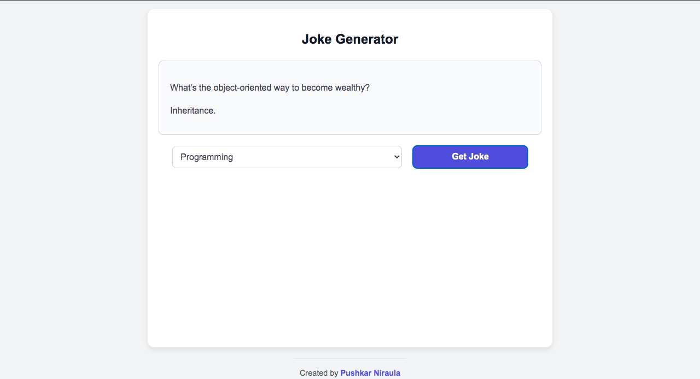
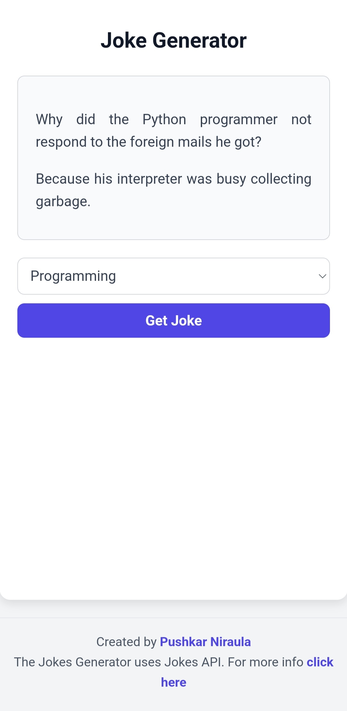

# Joke Generator

This is a simple Joke Generator web application that allows users to fetch and display jokes from the JokeAPI. Users can select the type of joke they want (e.g., Programming, Misc, Dark, Pun) and display either a single-line or two-part joke on the page.

## Features

* Fetch Jokes from JokeAPI: Retrieves jokes dynamically based on the selected type.

* Category Selection: Offers options like Programming, Misc, Dark, and Pun for tailored jokes.

* Responsive Design: The application is fully responsive and works across various screen sizes.

* Interactive UI: Includes a visually appealing button and dropdown for seamless interaction.

## Technologies Used

**Frontend**

* HTML

* CSS (Plain CSS for styling)

* JavaScript

**Getting Started**

****Prerequisites****

To run the project, you only need a web browser.

**Installation**

1. Clone the repository:

```bash
git clone https://github.com/puskarpy/jokes.git
```

2. Navigate to the project directory:
``` bash
cd jokes
```

3. Open the index.html file in your browser:

```bash
open index.html
```

## Usage

1. Open the web application.

2. Select a joke category from the dropdown menu (e.g., Programming, Misc, Dark, Pun).

3. Click the Get Joke button.

4. The joke will be displayed on the page. If the joke is two-part, both the setup and delivery will be shown.

5. For more information, click on the "Visit Joke API" link at the bottom of the page.

## File Structure
```bash
jokes
├── index.html 
├── style.css       
├── script.js      
└── README.md       
```
Screenshots

**Desktop View**



**Mobile View**



## API Reference

This project uses the JokeAPI. Below is an example request:
```bash
fetch("https://v2.jokeapi.dev")
  .then(response => response.json())
  .then(data => console.log(data));
```
## License

This project is open-source and available under the MIT License.

## Author

Created by [Pushkar Niraula](https://www.pushkarniraula.com.np).